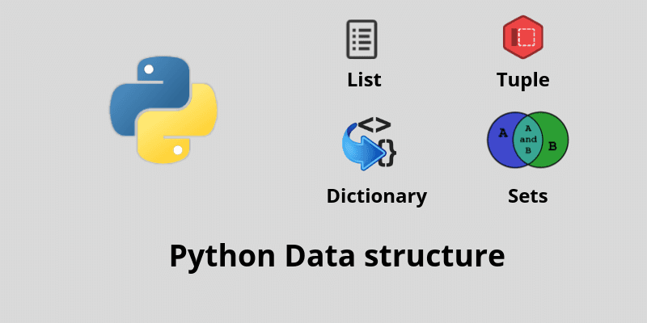

# Python - Data Structures: Lists, Tuples

## Discription 
Project tasks on topic of  Data Structures: Lists, Tuples in Python 
## What i learn
- Lists, their methods, and how to use them
- How to use lists as stacks and queues
- List comprehensions and how to use them
- Tuples and how to use them
- Sequences
- Tuple packing
- Sequence unpacking
- The `del` statement and how to use it
